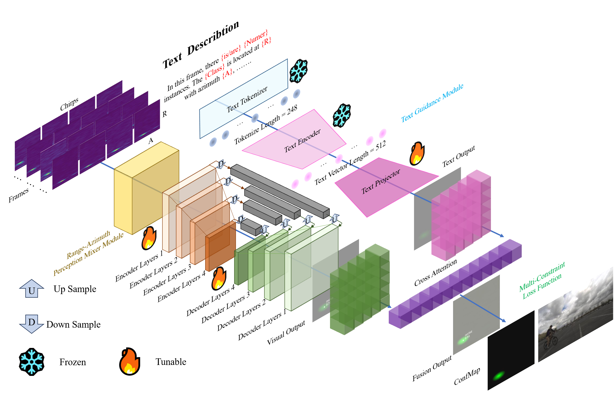

# TG-ROD: A Text-Guided Short-Range Object Radar Detector

This is the official implementation of TG-ROD from the paper [TG-ROD: A Text-Guided Radar Object Detector](https://arxiv.org/abs/).



## Data Preparation
* Download the CRUW ROD2021 dataset from https://www.cruwdataset.org/download. Download `TRAIN_RAD_H.zip` and `TRAIN_RAD_H_ANNO.zip`, the camera images and the testing set are not needed. Extract the zip files, and place the files as the following structure:
```cpp
├─ annotations
|  ├─ valid                      // 4 sequences - TRAIN_RAD_H_ANNO.zip
|  |  ├─ 2019_04_09_BMS1001.txt
|  |  └─ ...
|  └─ train                     // 36 sequences - TRAIN_RAD_H_ANNO.zip
|     ├─ 2019_04_09_BMS1000.txt
|     └─ ...
└─ sequences
|  ├─ test                      // 10 sequences - TRAIN_RAD_H.zip
|  |  ├─ 2019_05_28_CM1S013
|  |  |  └─ RADAR_RA_H
|  |  |     ├─ 000000_0000.npy
|  |  |     └─ ...
|  |  └─ ...
|  ├─ valid                      // 4 sequences - TRAIN_RAD_H.zip
|  |  ├─ 2019_04_09_BMS1001
|  |  |  └─ RADAR_RA_H
|  |  |     ├─ 000000_0000.npy
|  |  |     └─ ...
|  |  └─ ...
|  └─ train                     // 36 sequences - TRAIN_RAD_H.zip
|     |─ 2019_04_09_BMS1000
|     |  └─ RADAR_RA_H
|     |     ├─ 000000_0000.npy
|     |     └─ ...
|     └─ ...
└─ calib
   ├─ 2019_05_09
      ├─ cam_0.yaml            
   ├─ 2019_09_29
      ├─ cam_0.yaml                      
```
> [!IMPORTANT]
> The validating sequences are `2019_04_09_BMS1001`, `2019_04_30_MLMS001`, `2019_05_23_PM1S013`, `2019_09_29_ONRD005`, same as [T-RODNet](https://github.com/Zhuanglong2/T-RODNet) and other models test sequences.

> You can test the model on CRUW's test set using the test script we provided, and then submit the test results to an online website for online evaluation [ROD2021 Challenge](https://codalab.lisn.upsaclay.fr/competitions/1063#learn_the_details-overview) (Note: You need to register an account online).

## Program Preparation

* Clone this repository.
* Clone the [Long-Clip](https://github.com/beichenzbc/Long-CLIP) repository, and download the ([LongCLIP-B](https://huggingface.co/BeichenZhang/LongCLIP-B) and [LongCLIP-L](https://huggingface.co/BeichenZhang/LongCLIP-L)) pretrained models.
* Clone the [`cruw-devkit`](https://github.com/yizhou-wang/cruw-devkit) and rename it as `cruw`. (Note: It has not been maintained in recent years so modifications might be needed for it to work or use we provided.)
* Extract the zip files, and place the files to the `root` directory ras the following structure:
```cpp
├─ config
   └─TG-ROD.yaml
├─ cruw                           // We have provided the modified cruw package to ensure that the code can run properly.
|  └─ ...
├─ confmaps                       // When running the training script for the first time, '.pt' files will be automatically generated (a total of 40 files)
|  └─ 2019_04_09_BMS1000.pt
|  └─ ...
├─ Long_CLIP
|  ├─ checkpoints                 // 2 long-clip model weights
|  |  ├─ longclip-B.pt
|  |  └─ longclip-L.pt
|  └─ demo.py                     
|  └─ ...
└─ test.py
└─ train.py
└─ ...                  
```

## Installation

* Create a conda environment. TG-ROD was tested under Python 3.12, Pytorch 2.7.1 on Ubuntu with Nvidia RTX 4090 GPU.

* You can configure the environment yourself based on the [requirements.txt](requirements.txt).
```
conda create -n TGRAPMNet python=3.12

conda activate TGRAPMNet

pip install torch==2.7.1 torchvision==0.22.1 torchaudio==2.7.1 --index-url https://download.pytorch.org/whl/cu128

pip install -r requirements.txt
```

* Edit the paths in [TG-ROD.yaml](config/TG-ROD.yaml) to your own paths.

## Training
```sh
python train.py -c config/TG-ROD.yaml 
```
## Validating
```sh
python test.py -i -f valid -c config/TG-ROD.yaml  -r checkpoint.pt
```
## Testing
```sh
python test.py -f test -c config/TG-ROD.yaml -r checkpoint.pt
```
* We have provided the results of online testing, as shown in the table below.

| Data  |  Score  |    Filename   |   Submission date   | Size (bytes) |  Status  |
|-------|---------|---------------|---------------------|--------------|----------|
| Dev   | 73.5142 | submit_20.zip | 10/14/2025 10:51:55 |    483642    | Finished |
| Test  | 72.0357 | submit_20.zip | 10/21/2025 01:34:39 |    488384    | Finished |


## Visualization

* After Validating, you can also merge the visualized frames into a video by executing the following command.
```
python tools/vis/generate_demo_videos.py
```

## Acknowledgement
* Thanks to Fahed Hassanat, Robert Laganière and Martin Bouchard for their instructions and resources.
* Thanks to the Yizhou Wang team for making part of [the CRUW dataset](https://www.cruwdataset.org) public.
* Thanks to [MetaFormer](https://github.com/sail-sg/metaformer) authors for the lighweight archetecture.
* Thanks to [Long-Clip](https://github.com/beichenzbc/Long-CLIP) authors for the long sentence encode archetecture.
* Thanks to [SFHformer](https://github.com/deng-ai-lab/SFHformer) authors for the image restoration task.
* Thanks to other research teams including [T-RODNet](https://github.com/Zhuanglong2/T-RODNet) authors and [E-RODNet](https://github.com/lupeng-xm/E-RODNet) authors for their contributions to the ROD field.
* Thanks to [mRadNet](https://github.com/huaiyu-chen/mRadNet) authors for their excellent work !!! 

## Citation
If you use this code or find it helpful for your research, please cite our paper:

```bibtex

```
